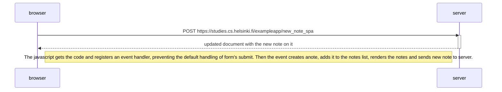

```mermaid
sequenceDiagram
    participant browser
    participant server

    browser->>server: POST https://studies.cs.helsinki.fi/exampleapp/new_note_spa
    activate server
    server-->>browser: updated document with the new note on it
    deactivate server

    Note right of browser: The javascript gets the code and registers an event handler, preventing the default handling of form's submit. Then the event creates anote, adds it to the notes list, renders the notes and sends new note to server.
```